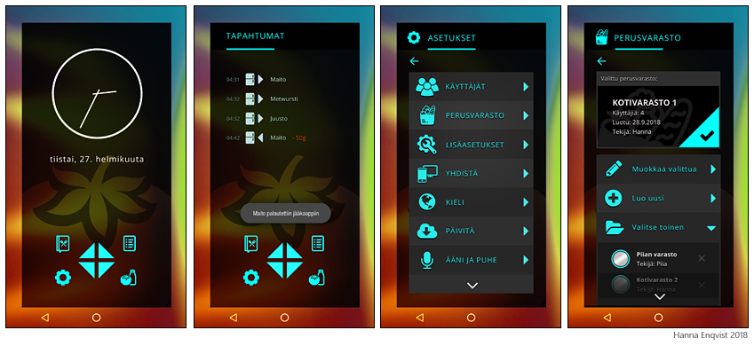

## Tietojärjestelmän suunnittelu, harjoitustyö 2018

Projektissa suunnittelen kuvitteelliselle älykkäitä jääkaappeja valmistavalle yritykselle tarvittavan tietojärjestelmän, ja jääkaapin käyttöliittymän rajatun prototyypin. Suunnitelmassa tarvittavan laitteiston, toteutussuunnitelman (luku 5) ja teknologian osalta sai käyttää mielikuvitusta. Harjoitustyö on esimerkki "use case driven design":sta, eli järjestelmän suunnittelemisesta käyttötapausten pohjalta. 

### Kurssi

- Tietojärjestelmien suunnittelun perusteet, 5 op
  - kevät 2018, Tampereen yliopisto
  - [Kurssin kuvaus](https://www10.uta.fi/opas/opintojakso.htm?id=30352&lang=fi&lvv=2017&uiLang=fi)

## Sisältö

- [Harjoitustyön tehtävänanto](tehtavananto-2018.pdf) (Tiainen, Mäkiaho)
- [Valmis työni (pdf)](SuPe_HT_Hanna_Enqvist_FINAL_v2.pdf). Tiedosto on suuri (3.6MB), joten suosittelen lataamaan koneelle lukemisen helpottamiseksi.
- Esimerkkitietokannan luonti- ja tietojenlisäyslauseet
- Esimerkkitietokantaan tehdyt kyselyt

### Esimerkkikuvia prototyypistä
Prototyyppi on nopea luonnos siitä, miltä jääkaapin käyttöliittymä voisi mahdollisesti näyttää. Lisää kuvia, sekä näyttösiirtymäkaavio työn pdf:ssä.

