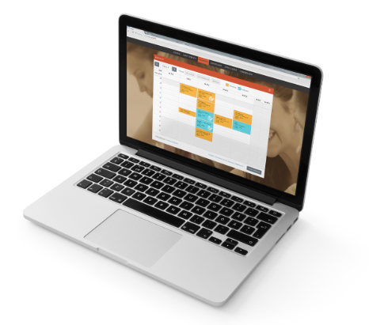
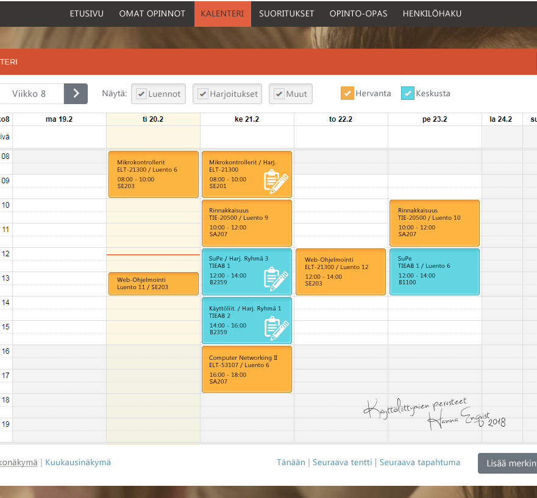
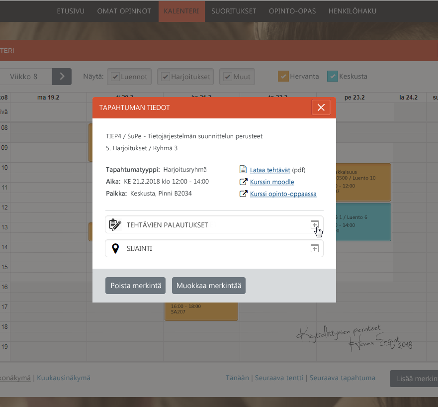
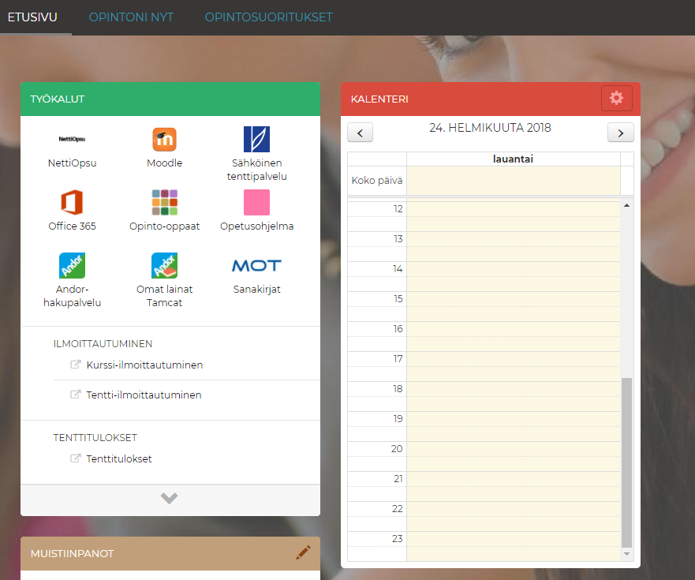

## Palvelun kehittämisen suunnitteluharjoitus 1
#### Aihe: Opiskelijan työpöytä
Suunnitteluharjoituksessa keskityn kehittämään Tampereen yliopiston Opiskelijan työpöytä -palvelun käytettävyyttä, sekä korjaamaan palvelussa esiintyviä käytettävyysongelmia. Raportti on rajattu käsittelemään pääasiassa kalenterin ominaisuuksia. Työn voi ladata [tästä](SH1_Hanna_Enqvist-v13.pdf).

## Sisältö

- [Suunnitteluharjoituksen tehtävänanto](SH1_tehtavananto_2018.pdf) 
- [Valmis työni (pdf)](SH1_Hanna_Enqvist-v13.pdf) 

> GitHubin esikatselu sumentaa ja venyttää dokumentin kuvia. Jotta kuvat olisivat tarkkoja, suosittelen dokumentin tarkastelua 87,2% zoomilla esimerkiksi Adoben Acrobat readerilla.

## Kurssi

- Käyttöliittymien perusteet, 5 op
  - kevät 2018, Tampereen yliopisto
  - [Kurssin kuvaus](https://www10.uta.fi/opas/opintojakso.htm?id=30116&lang=fi&lvv=2017&uiLang=fi)

## Kuvia uudistetusta kalenterista

    
    

## Tämänhetkinen Opiskelijan työpöydän kalenteri
Alla vertailun vuoksi rajattu kuva nykyisestä Opiskelijan työpöydästä, ja sen kalenterista.

   

